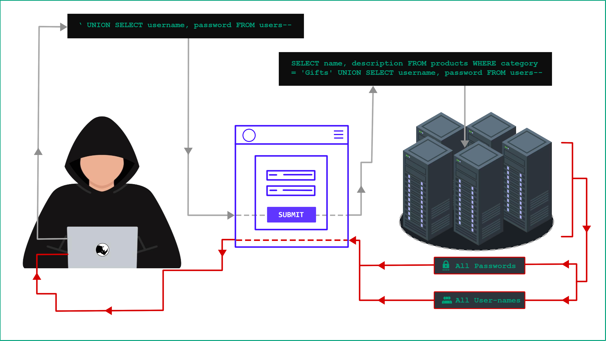

## **SQL Injection Payloads List**

### **SQL Injection**

In this section, we'll delve into the world of SQL injection, unveiling its intricacies and illustrating common attack vectors. We’ll explore techniques to identify and exploit diverse SQL injection vulnerabilities, while also providing essential strategies to safeguard against these critical threats.

### **What is SQL injection (SQLi)?**

SQL injection is a critical web security vulnerability that empowers attackers to manipulate the queries an application sends to its database. By exploiting this flaw, attackers can access sensitive data beyond their authorized reach, potentially exposing information belonging to other users or any data the application can access. This access can lead to unauthorized data modification or deletion, resulting in lasting alterations to the application's functionality and content.

Moreover, SQL injection attacks can escalate, enabling attackers to breach the underlying server or compromise other back-end infrastructure. In extreme cases, these attacks can even facilitate denial-of-service events, severely disrupting the availability of the application.

